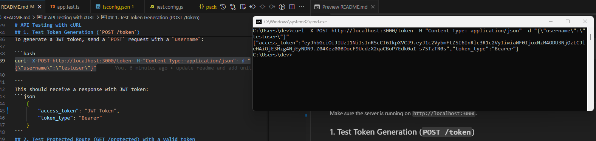
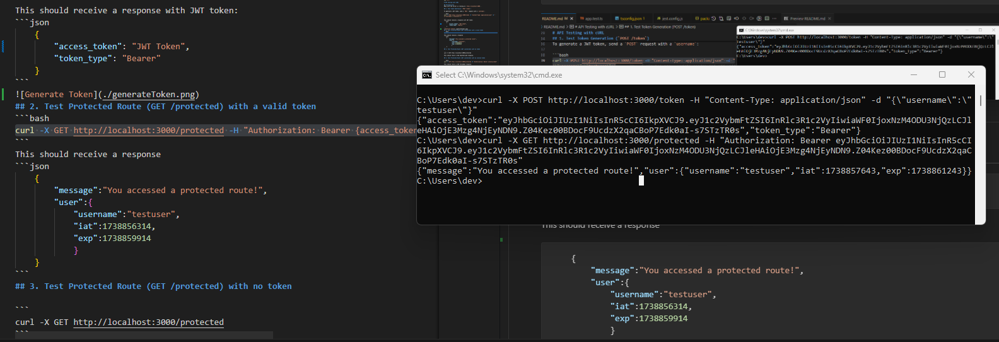
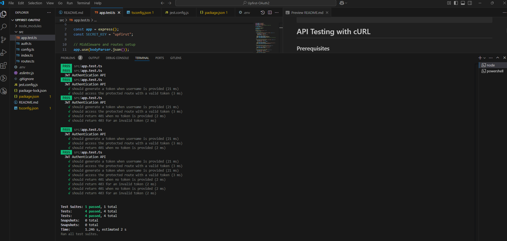

# Upfirst-OAuth2 Home Task

# JWT Authentication API

1. **Generate a JWT Token**: The `/token` endpoint generates a JWT token when a username is provided.
2. **Protected Route**: The `/protected` endpoint can only be accessed with a valid JWT token.

### Install Dependencies

To get started, clone the repository and install the required dependencies:

```bash
npm install
```

### Runing server
```bash
npm start
```
# API Testing with cURL

## Prerequisites
Make sure the server is running on `http://localhost:3000`.

## 1. Test Token Generation (`POST /token`)

To generate a JWT token, send a `POST` request with a `username`:

```bash
curl -X POST http://localhost:3000/token -H "Content-Type: application/json" -d "{\"username\":\"testuser\"}"

```
This should receive a response with JWT token:
```json
    {
        "access_token": "JWT Token",
        "token_type": "Bearer"
    }
```

## 2. Test Protected Route (GET /protected) with a valid token
```bash
curl -X GET http://localhost:3000/protected -H "Authorization: Bearer {access_token}"
```
This should receive a response
```json
    {
        "message":"You accessed a protected route!",
        "user":{
            "username":"testuser",
            "iat":1738856314,
            "exp":1738859914
            }
    }
```

## 3. Test Protected Route (GET /protected) with no token

```
curl -X GET http://localhost:3000/protected
```
This should return a 401 Unauthorized response.

## 4. Test Protected Route (GET /protected) with an invalid token

```bash
curl -X GET http://localhost:3000/protected -H "Authorization: Bearer invalid_token"
```
This should return a 403 Forbidden response.

# Unit Test
```bash
    npm test
```
